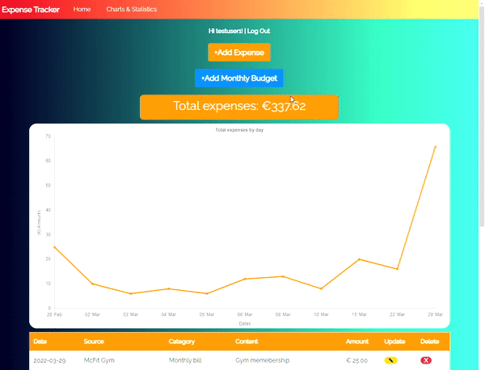
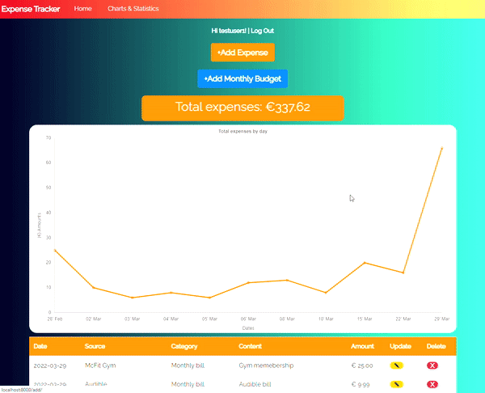
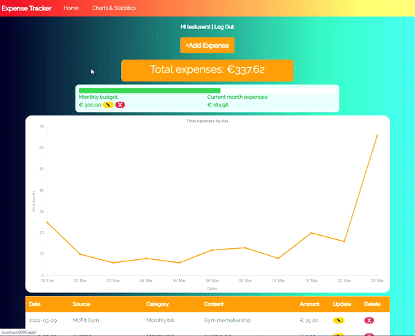

Expense Tracker is application that can help you track and list expenses, and also analyze charts and statistics about them.

The project uses authentication and CRUD operations to create, read, update and delete expenses assigned to a user.

The project also performs operations on expenses in order deliver monthly and daily expense averages; current vs last month expense percentages; biggest and smallest expenses by category; and more.

 <h2>Desktop</h2>
 

  <h2>Mobile</h2>
 

## Usage

### Adding Expenses

You can add an expense by clicking the "Add Expense" button, filling and submitting the expense form.

Once you've added the expense it will be displayed on the total expenses element, the homepage's line chart and will also be listed below on the expenses table.

**Note:**  
_Line chart will only appear if you have 2 or more expenses added._

### Adding Monthly Budget

You can add a monthly budget by clicking the
Add Monthly Budget button, filling and submitting the form.

Once you've added it the budget UI will be displayed, including the budget progress bar, the monthly budget next to the expenses of the current month and the edit and delete buttons.

### Checking Charts & Statistics

Finally you can access charts and statistics about your expenses by navigating to the Charts & Statistics section.

Here you can find expense charts with amounts grouped by month and week, as well as total and monthly expenses grouped by categories.

You can find your current monthly expenses (with controls for editing or deleting budget here too), as well as last month expenses and statistics like monthly expense average, daily expense average, current vs last month expense percetange difference and more.

 

### Credentials

username: testuser1  
password: testpass1

 

## Installation

For installing the Django application clone the repository and cd inside the directory

    cd django-expense-tracker

And run:

     pipenv install

This will install the virtual environments and all dependencies.

Now start the virtual environment shell:

     pipenv shell

Run migrations:

    python manage.py makemigrations
    python manage.py migrate

Create superuser:

    python manage.py createsuperuser

Now you can start server...

    python manage.py runserver

...and visit http://localhost:8000/

## (NEW) React Front-end

The application now includes an embedded react front-end by default, in place of the old template-based front-end. The template files and older django views, urls and other files are still included in the repository, but this is temporary. In the future those files will be removed from the repo to leave only the new react-based front-end.

**Note:**  
Because the current front-end is directly embedded in django (which means django settings are looking for the templates directory in the front-end's build/ directory, and also that django looks for static files in such build/ directory), this means you only need to start one server to run both the backend and the front-end of
the application. The draw back of this is that, unlike when you work on the server specific to your react application (generally http://localhost:3000/), where you can see changes done to the application being displayed on the screen as soon as you save any changed file, now it is a bit more complicated.

## How to install the Front-end

First of all you have to install the front-end packages. In case you want to start the react server in order to see changes to the front-end faster just need to cd to the front-end/ directory and run:

    npm install --legacy-peer-deps

Once that's installed, you can run:

    npm run start

in order to start the react server on http://localhost:3000/.

## How to make Front-end updates

So basically whenever you want to see your changes to the front-end displayed on the browser(without starting the react server and using only the django server), you have to save your changed files, cd to the front-end/ directory  and run:

    npm run build

on the front-end directory in order to update the build/ directory with your latest changes.

After that you need to cd to the root of the repository (where manage.py and this README file are located), and run:

    python manage.py collectstatic

Then when asked by the prompt type 'yes' to overwrite existing staticfiles.

After that run:

    python manage.py runserver

and you should see the changes you added previously now displayed on the page.

## Installation - Cypress

For installing Cypress go to the e2e directory and run:

    npm install

## Tests

| Type   | Location                                                                     |
| ------ | ---------------------------------------------------------------------------- |
| ui     | [e2e/cypress/integration/ui-tests](e2e/cypress/integration/ui-tests)         |
| visual | [e2e/cypress/integration/visual-tests](e2e/cypress/integration/visual-tests) |
| unit   | [expenses/tests](expenses/tests)                                             |

## Running tests

### Unit tests

For running the tests run:

    python manage.py test

### E2E tests

For running the tests run:

    npm run test

For running the tests on headless mode run:

    npm run test:headless

For opening cypress client run:

    npm run test:open

## Uses

- Django.
- Postgres.
- Bootstrap.
- Chart.js.
- Cypress.

## Features

- Expense list.
- Expense charts.
- Monthly budget bar.
- Statistics table.
- Authentication.
- Form validation.
- Pagination.
- UI tests.
- Visual tests.
- Unit tests.
